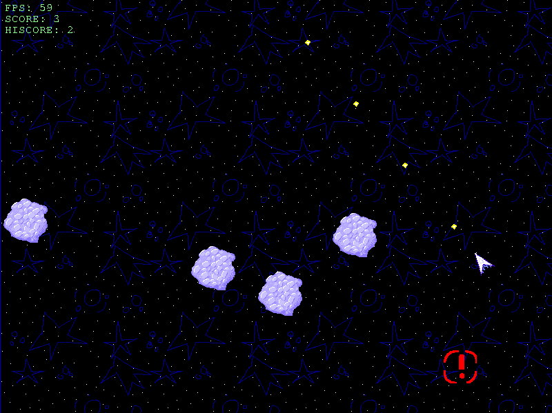

# asteroids-js

This is an asteroids clone I wrote in JavaScript for my school's coding club officer application. I made it in my free time over the course of 3-4 days and it uses the HTML5 canvas for drawing.

In the game, you use the arrow keys to turn and accelerate your ship and the Z key to shoot.

As the game runs, asteroids will increasingly fill the screen, and you must last as long as possible, cautiously drifting around them and shooting them to pieces to survive.

This game also comes with a detailed breakdown of its code, aimed to teach people how it was made and how to make their own JavaScript games, found in doc.html
